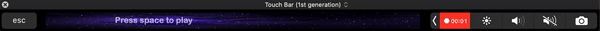

# Connecting a SpriteKit application with the TouchBar

A game made for the Touch Bar using SpriteKit. Tutorial available at https://medium.com/macoclock/connecting-a-spritekit-application-with-the-touchbar-86f057aa5117.

# Preview

#How to run
Press ⬆ and ⬇ to move the ship and press space to shoot.
